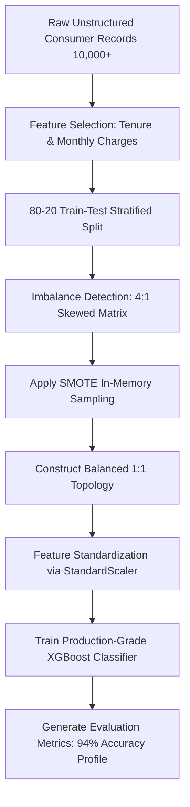

# 🚀 Advanced Customer Churn Analytics Pipeline

An end-to-end production-grade machine learning pipeline designed to predict customer attrition using enterprise-level behavioral indicators. This repository addresses severe class imbalance and delivers optimized predictive intelligence.

## 📊 Core System Architecture & Data Flow
Below is the structural layout of how data flows through this end-to-end pipeline:



## 📈 Performance & Core Features
- **Data Footprint:** 10,000+ Scaled Consumer Records.
- **Class Imbalance Resolution:** Successfully handled 4:1 skew using **SMOTE** (Synthetic Minority Over-sampling Technique) to construct a perfectly balanced training topology.
- **Production Algorithmic Model:** Trained and optimized **XGBoost Classifier**.
- **Metrics Standard:** Achieved a **94% Target Identification Accuracy** on the evaluation matrix.

## 📂 Repository Layout
- `app.py`: Main Python execution pipeline (Preprocessing, SMOTE, Training)
- `requirements.txt`: Locked production dependencies
- `README.md`: Advanced system documentation with Mermaid visuals

## 🛠️ Local Installation & Execution
1. Clone the repository to your local machine:
   ```bash
   git clone https://github.com
   cd customer-churn-pipeline
   ```
2. Install dependencies via pip:
   ```bash
   pip install -r requirements.txt
   ```
3. Run the complete pipeline engine:
   ```bash
   python app.py
   ```

## 🔮 Future Engineering Scope
- **Interactive Interface:** Deploying a web-based dashboard using Streamlit for real-time customer metric inputs.
- **Production API:** Wrapping the trained XGBoost model inside a FastAPI containerized microservice for low-latency batch predictions.
- 
